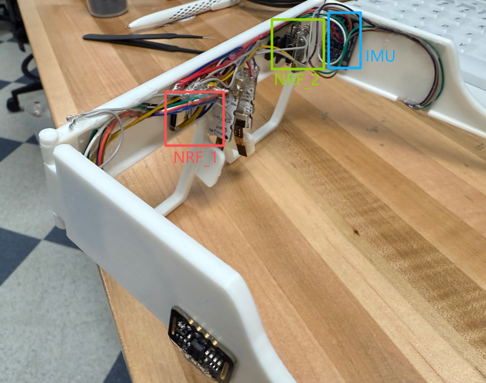

# multifunctional_glasses user guidance
<h2>2ch_IMU + 2ch_BCM</h2>
<h3>Sample rate: IMU- 100Hz, BCM-40kHz</h3>

In folder 2bcm_2imu， .ino is the arduino firmware for nrf_1, the .py file is the data collection part runs on PC.

Use a type-c cable to connect nrf, then connect the other end to the computer, and then start the python program to receive data.  
Then follow the instructions on the terminal, press enter to start, and press enter again to end data collection.  
The BCM data will be saved as a dual-channel wav file, and a .txt file with only the raw data will also be saved.     
The IMU data will also be saved in a txt file. Also feel free to change the sample rate of IMU in the firmware.       
Each generated IMU.txt file contains a sequence of IMU samples recorded from two sensors (IMU1 and IMU2).  
Each line in the file includes 18 values, separated by spaces following the structure:  
<b>[ax1 ay1 az1 gx1 gy1 gz1 mx1 my1 mz1 ax2 ay2 az2 gx2 gy2 gz2 mx2 my2 mz2]</b>
